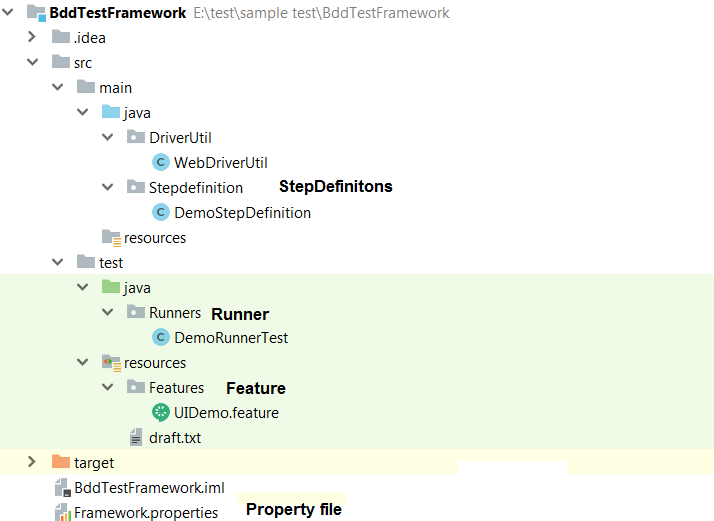
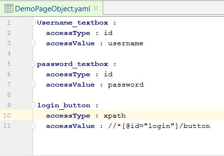
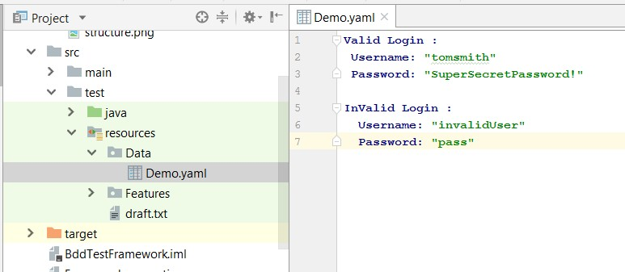
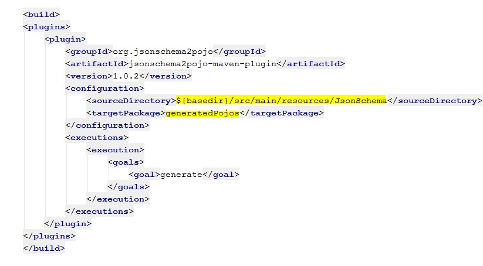

 <h1>BDD Test framework</h1>
<h3>Behavior Driven Development Cucumber - Selenium , Restassured based automation framework for UI and Webservice test automation including Extent reports</h3>

<h5>Contact</h5> : <a href="mailto:prateekanandspet@gmail.com">prateekanandspet@gmail.com></a>
<h5>LinkedIn </h5>: <a href="https://www.linkedin.com/in/prateekanand1/> Prateek Anand></a>
	
	
<h2>Steps to install at your system:</h2>
	<ul>
	<li>Clone the repository using "git clone <repository url>"</li>
	<li>Run maven "clean install"</li>
	</ul>

<h2>Directory Structure</h2>

<h2>Steps to create UI test</h2>
<h4>Refer UIDemo.feature </h4>
 <li>Set Browser name to be used in Framework.properties.</li> 
 <li>For driver create instance to </li>
<code>WebDriver driver = WebDriverUtil.Webdriver();</code> 
 <h5>Use object reposiotry</h5>
<li>Create object repository YAML file in following structure</li>

<li>Create Reference for page object class with driver instance and Page object YAML path</li>
ex
 <code>pageObject pageObject =new pageObject(driver,"src\\test\\resources\\PageObjects\\DemoPageObject.yaml");</code>
and call GetElement(--element key in Yaml--) .
 <code> pageObject.GetElement("login_button").click();</code>

<h2>Steps to get data from data file</h2>
<li>Add Data in Yaml file with Data set names</li>
 

<li>Create instance for YAMLReader class with file name and path</li>
Ex
<code> YAMLReader yamlReader =new YAMLReader("src\\test\\resources\\Data\\Demo.yaml");</code> 
  and call 'GetDataSet(<Dataset Name>)' ,This method returns data in map
 <code>LinkedHashMap DataMap= yamlReader.GetDataSet("Valid login");</code>
     <code>   String username = DataMap.get("Username");</code> 

<h2>Steps to create WebService test</h2>
<h4>Refer APIDemo.feature</h4>
<li>Json schema to pojo creation : Specify Json schema path and tagret durectory at plugin in pom.xml</li>

<li>Place json schema in source directory and run Maven 'clean generate-sources' , The pojo classes will be generated in target/generated-sources/jsonschema2pojo package.</li>

Ex:
For the below JSON request body
<code> {
    "name": "morpheus",
    "job": "leader"
}</code>
Place the Schema at source directory (you could create json schema at <a href="https://www.liquid-technologies.com/online-json-to-schema-converter" >JsontoPojoConverter> </a>) ,pojo class 'APIdemoSchema' is generated 

<li>Import the generated package and use the setter methods to pass data</li>
  <code>APIdemoSchema Data =new APIdemoSchema();</code>
      <code>Data.setJob(job);</code>
         <code>Data.setName(name);</code>
	 Then convert the object into string Using Object Mapper and use in Restassured post body
 <code>
 ObjectMapper objectMapper =new ObjectMapper();</code>
 <code>String RequestBody =objectMapper.writeValueAsString(Data);</code>

 <code>Response =
                RestAssured.given().
                        contentType(ContentType.JSON).body(RequestBody).
                                        post("/users");
</code>

<h2>Reports</h2>
By default report is set to be generated at target/cucumber-reports/report.html . Update in Runner file pluggin option for custom location
